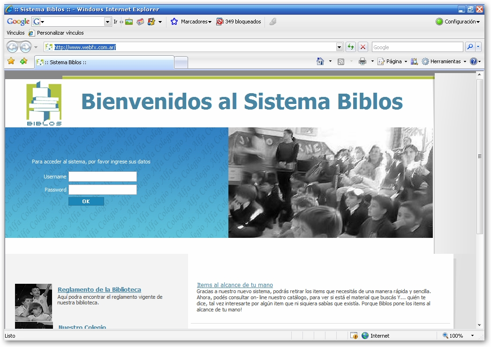



## Biblos \- Complete Books Library Manager

### Description

Biblos is an open source book library manager. It's fully operational, and it's ment to be used by educational libraries everywhere.

It was made using a 3 tier framework implementation, using XML as interlayer communication and mysql as database.

It has a fully implemented security system, either by value or by role.

To install just compile and register the VB dlls, and then just configure the site to point to the asp files.

If you are interested I also have the user, and admin manuals.
 
### More Info
 
I want to say thanks to all the developers who indirectly contributed to this project. You'll find the remarks when you look through it.

Cheers and keep coding!

             |
---                |---
**Submitted On**   |2007-05-15 16:28:46
**By**             |[Gaston Algaze](https://github.com/Planet-Source-Code/PSCIndex/blob/master/ByAuthor/gaston-algaze.md)
**Level**          |Advanced
**User Rating**    |5.0 (10 globes from 2 users)
**Compatibility**  |VB 6\.0, ASP \(Active Server Pages\) 
**Category**       |[Complete Applications](https://github.com/Planet-Source-Code/PSCIndex/blob/master/ByCategory/complete-applications__1-27.md)
**World**          |[Visual Basic](https://github.com/Planet-Source-Code/PSCIndex/blob/master/ByWorld/visual-basic.md)
**Archive File**   |[Biblos\_\-\_C2065885152007\.zip](https://github.com/Planet-Source-Code/gaston-algaze-biblos-complete-books-library-manager__1-68599/archive/master.zip)

